# TravelAI

<p align="center">
  
  
  
  
  
</p>

<p align="center">
  사용자 입력을 바탕으로 <b>Day별 여행 루트</b>를 추천하고, <b>LLM + RAG</b>로 추천 이유까지 설명하는 AI 여행 일정 추천 웹 서비스
</p>

<p align="center">
  <a href="https://github.com/taro87"><b>GitHub Profile</b></a>
</p>

---

## 목차
- [프로젝트 소개](#프로젝트-소개)
- [문제 정의](#문제-정의)
- [핵심 기능](#핵심-기능)
- [내 역할](#내-역할)
- [기술 스택](#기술-스택)
- [데이터 구성](#데이터-구성)
- [시스템 흐름](#시스템-흐름)
- [구현 포인트](#구현-포인트)
- [프로젝트 결과](#프로젝트-결과)
- [실행 방법](#실행-방법)
- [프로젝트 구조](#프로젝트-구조)
- [서비스 화면](#서비스-화면)
- [발표 자료 미리보기](#발표-자료-미리보기)
- [회고](#회고)

---

## 프로젝트 소개
TravelAI는 여행 도시, 기간, 취향을 입력하면 여행 일정을 Day 단위로 추천해주는 웹 서비스입니다.

단순히 인기 장소를 나열하는 방식이 아니라,
- 도시/카테고리 기준 후보 추출
- 평점, 리뷰 수, 거리 기반 스코어링
- 일정 균형과 이동 동선 고려
- LLM + RAG 기반 추천 이유 생성

까지 하나의 흐름으로 연결해 실제로 활용 가능한 여행 계획을 만드는 데 초점을 맞췄습니다.

---

## 문제 정의
여행 계획을 세울 때 가장 번거로운 부분은 정보를 찾는 것보다 **선택하고 정리하는 과정**이라고 생각했습니다.

기존 방식은 아래와 같은 불편이 있었습니다.
- 블로그, 지도, 리뷰가 분산되어 있어 결정 피로가 큼
- 장소를 많이 찾더라도 실제 동선이 비효율적인 경우가 많음
- 계획을 다시 문서나 발표 자료로 정리하는 데 시간이 많이 듦

이 프로젝트는 이런 흐름을 줄이고,
사용자가 입력한 조건을 바탕으로 **추천 - 설명 - 정리**까지 이어지는 경험을 만드는 것을 목표로 했습니다.

---

## 핵심 기능
- 여행 도시, 기간, 스타일 기반 Day별 일정 추천
- 명소 / 맛집 / 카페 등 카테고리별 후보 분리
- 평점, 리뷰 수, 거리 기반 스코어링
- 랜드마크 우선 반영 및 일정 균형 조정
- LLM + RAG 기반 추천 이유 생성
- 지도와 요약 정보 연동
- 일정 편집 및 결과 정리 기능
- PPT / PDF 형태로 결과 공유 가능

---

## 내 역할
이 프로젝트에서 저는 아래 역할을 맡았습니다.

### 1) 프로젝트 매니저
- 전체 기능 흐름 정리
- 작업 우선순위 조율 및 일정 관리
- 발표 전 최종 결과물 품질 점검

### 2) LLM 및 RAG 구현
- 추천 결과에 대한 설명 생성 흐름 설계
- 검색 기반 근거를 활용하는 RAG 구조 구현
- 사용자 입력과 추천 결과를 연결하는 프롬프트 흐름 정리

### 3) 미슐랭 데이터 웹 크롤링 및 수집
- 추천 품질 강화를 위한 외부 맛집 데이터 확보
- 수집 데이터 정리 및 프로젝트 데이터셋 보강

### 4) PPT 작성 및 발표
- 발표 자료 전체 구성
- 프로젝트 배경, 설계, 결과 정리
- 최종 발표 진행

---

## 기술 스택
### Backend
- Python 3.11
- Django 4.2
- SQLite

### Data / AI
- Pandas
- NumPy
- scikit-learn
- LLM
- RAG
- Ridge Ranker

### Frontend
- HTML
- CSS
- JavaScript

### Infra / Tools
- Cache
- OpenAI API
- 외부 장소 데이터 API
- python-pptx
- reportlab

---

## 데이터 구성
- **POI 데이터 1,638개**
- **25개 도시**
- **10개 카테고리**
- **미슐랭 크롤링 데이터 18,827건**

데이터 전처리 과정에서는 아래 작업을 진행했습니다.
- 중복 제거
- 카테고리 재분류
- 평점 / 리뷰 수 기준 정제
- 도시별 후보 개수 보정
- place_id 기준 품질 관리

---

## 시스템 흐름
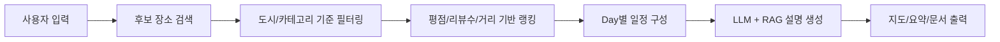

### 추천 로직 요약
1. 도시 및 카테고리 기준으로 후보 장소를 수집합니다.
2. 평점, 리뷰 수, 거리, 선호도를 반영해 우선순위를 계산합니다.
3. 명소/식사/카페 비율이 한쪽으로 치우치지 않도록 일정을 조정합니다.
4. 최종 일정에 대해 LLM + RAG로 추천 이유를 함께 제공합니다.

---

## 구현 포인트
### 1) 설명 가능한 추천 구조
추천 결과만 보여주는 것이 아니라, 사용자가 납득할 수 있도록 추천 이유를 함께 제공하는 데 집중했습니다.

- 추천 결과와 설명 결과를 분리하지 않고 하나의 흐름으로 설계
- 검색 기반 근거를 활용해 설명 신뢰도 보완
- 과장된 문장보다 정보 전달 중심의 응답 구조 지향

### 2) Michelin 데이터 보강
맛집 추천 품질을 높이기 위해 미슐랭 데이터를 별도로 수집하고 프로젝트 데이터셋에 반영했습니다.

- 웹 크롤링을 통해 맛집 데이터 확보
- 기존 POI 데이터와 연결해 추천 후보 강화
- 맛집 카테고리의 정보 밀도 보완

### 3) 일정 전체 흐름 관점에서 기획
프로젝트 매니저 역할을 맡으면서 단순 기능 구현보다,
사용자가 서비스를 사용할 때 어떤 순서로 경험하는지가 더 중요하다고 봤습니다.

그래서 아래 부분을 지속적으로 조율했습니다.
- 추천 결과의 일관성
- 기능 우선순위 정리
- 발표용 결과물과 실제 서비스 흐름 연결

---

## 프로젝트 결과
### v1.0.0
- Day별 추천 루트 생성
- 루트 요약 / 지도 출력
- PPT 생성 기능 안정화

### v6.5.4
- DB 사용 및 회원 관리
- 일정 편집 기능
- 지도 / 요약 동기화
- 숙소 더보기 및 분류
- 교통 보기 모달
- 비용 최적화
- LLM 및 RAG 강화
- Django 기반 구조 정리

---

## 실행 방법
```bash
# 1. clone
git clone https://github.com/taro87/ai.git
cd ai

# 2. virtual environment
python -m venv venv
source venv/bin/activate   # Windows: venv\Scripts\activate

# 3. install
pip install -r requirements.txt

# 4. environment
cp .env.example .env

# 5. migrate
python manage.py migrate

# 6. run
python manage.py runserver
```

### 주요 환경 변수
```env
OPENAI_API_KEY=
ANTHROPIC_API_KEY=
GOOGLE_PLACES_API_KEY=
GEOAPIFY_API_KEY=
AMADEUS_CLIENT_ID=
AMADEUS_CLIENT_SECRET=
```

---

## 프로젝트 구조
```text
.
├── accounts/
├── api/
├── data/
│   ├── poi_dataset.csv
│   ├── michelin_restaurants.csv
│   └── michelin_restaurants_matched.csv
├── instance/
├── templates/
├── static/
├── manage.py
├── requirements.txt
└── .env.example
```

---

## 서비스 화면
### 메인 화면
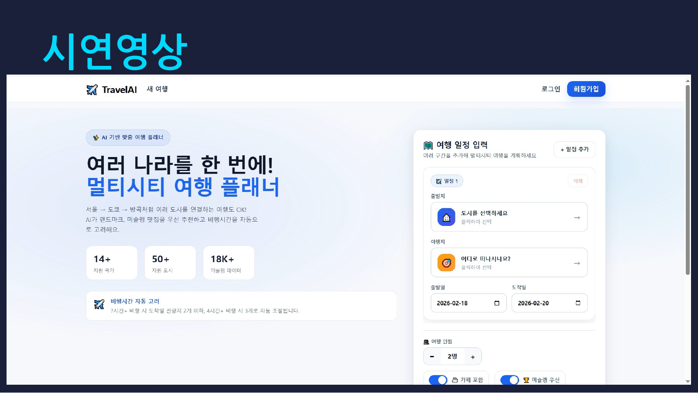

### 최종 결과물 요약
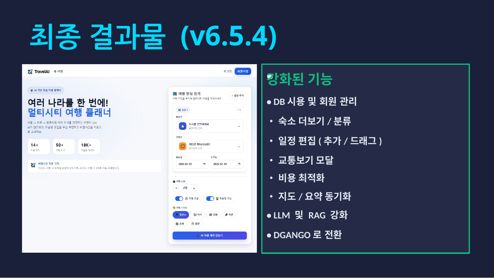

---

## 발표 자료 미리보기
> GitHub README에서 바로 볼 수 있도록 슬라이드를 페이지별로 정리했습니다.

<details>
<summary><b>전체 PPT 펼쳐보기 (19 pages)</b></summary>

### 01. 표지


### 02. 목차
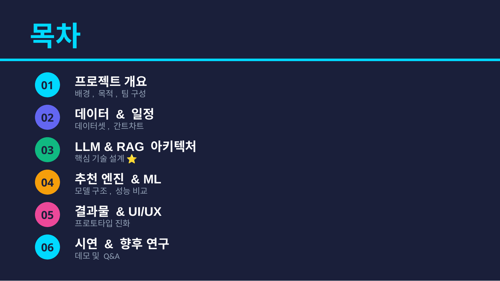

### 03. 프로젝트 배경
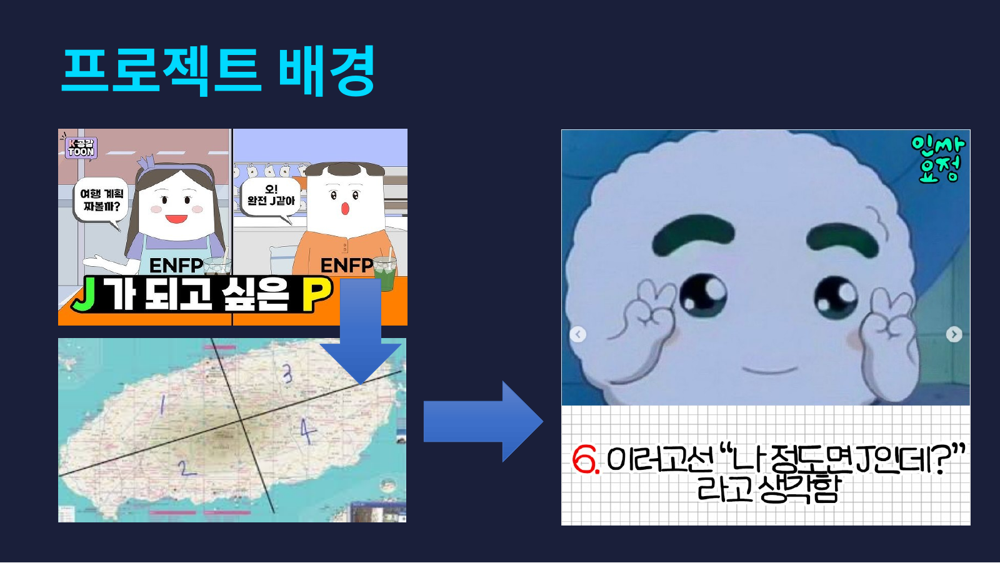

### 04. 프로젝트 배경
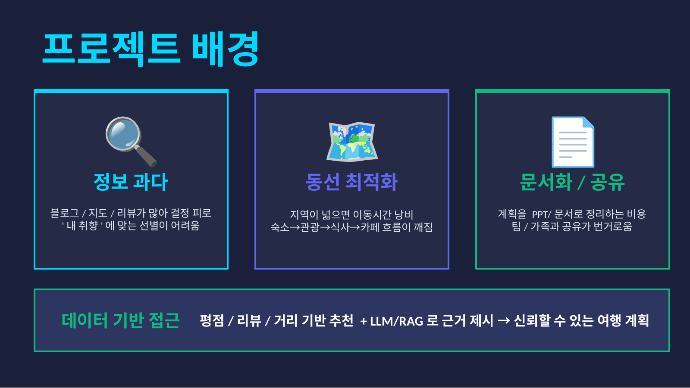

### 05. 개발 목적 및 팀 구성
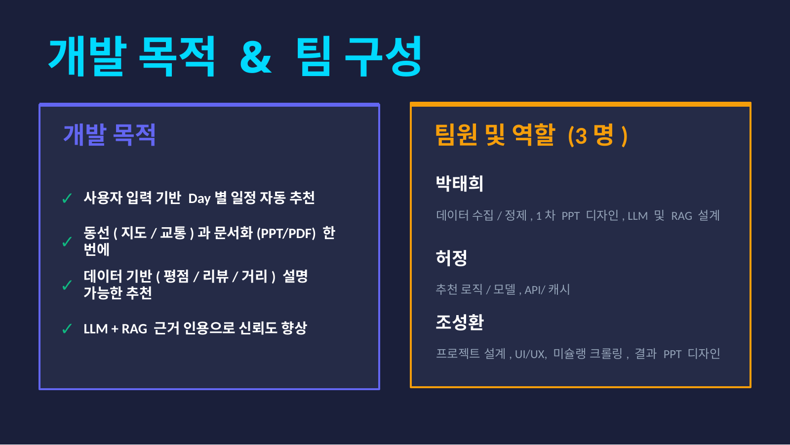

### 06. 프로젝트 일정
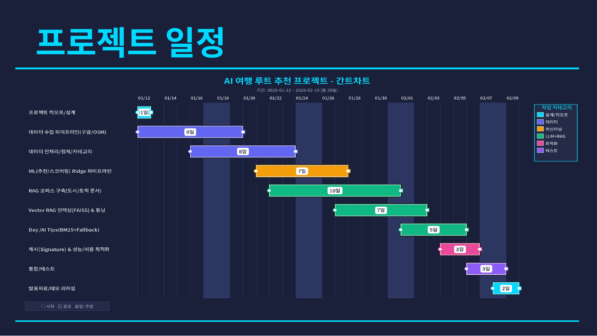

### 07. 사용 데이터
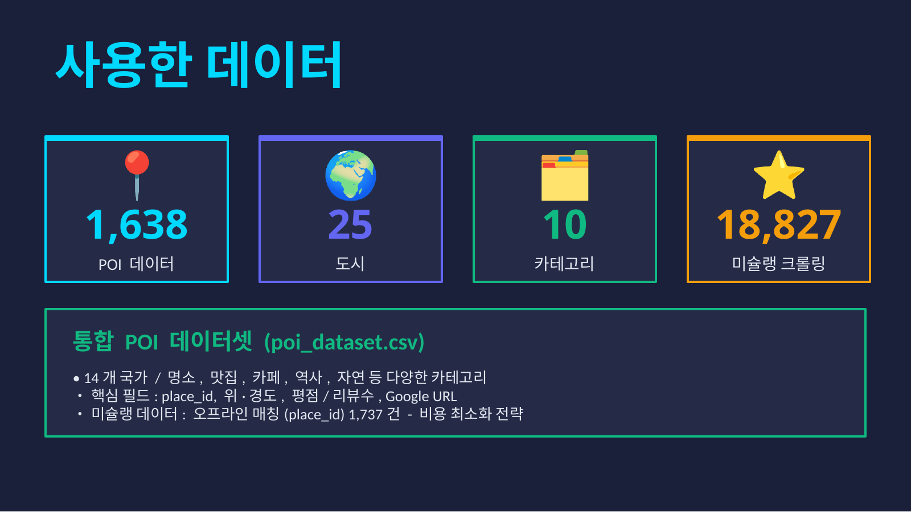

### 08. 데이터 전처리 및 품질 관리
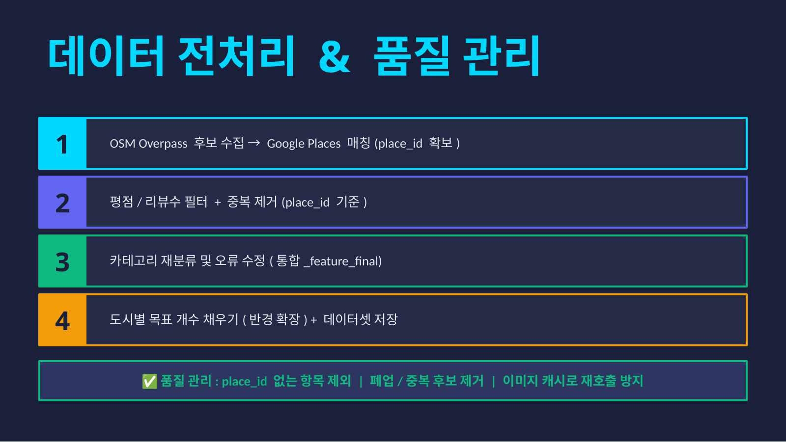

### 09. LLM + RAG 아키텍처
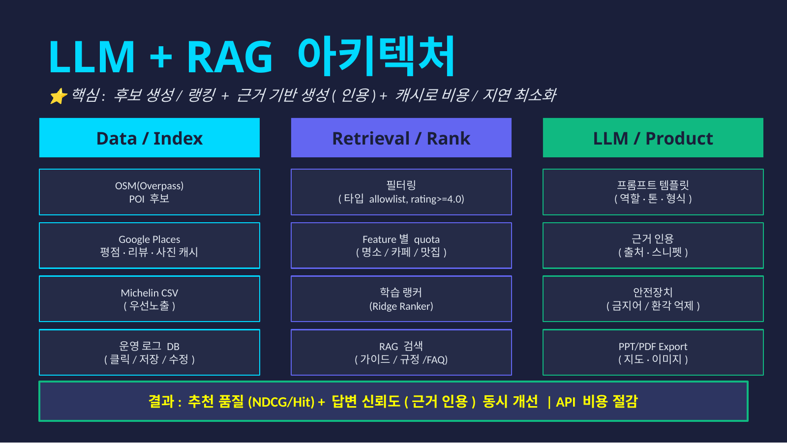

### 10. RAG 검색 전략 및 근거 인용
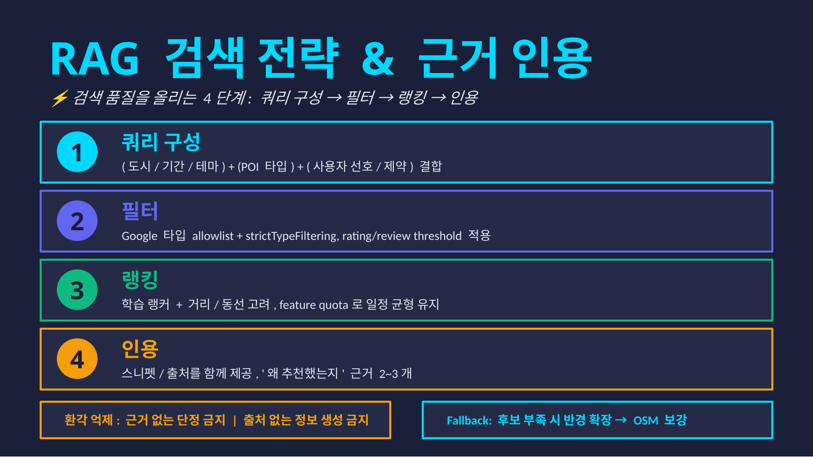

### 11. 추천 엔진 설계
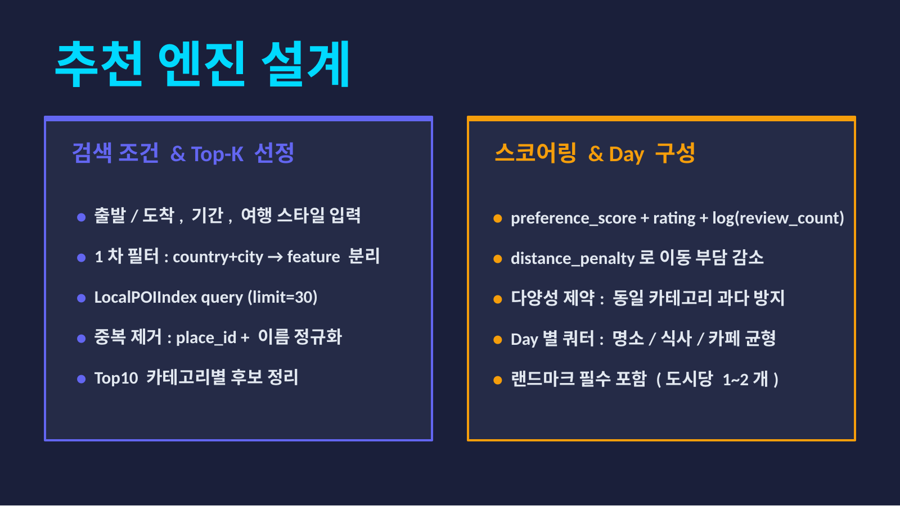

### 12. ML 모델 및 성능 비교
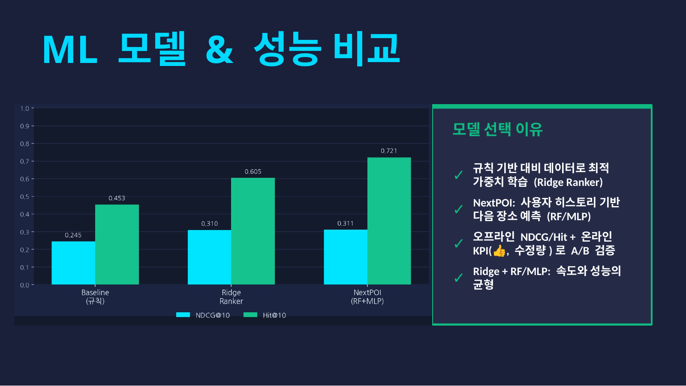

### 13. 독립변수 분석 / 비용 최적화
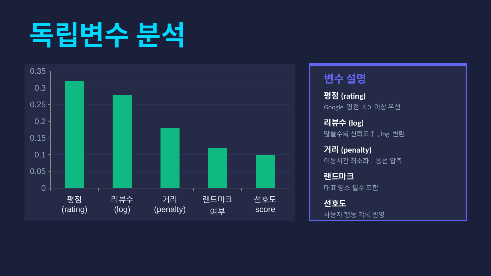

### 14. 비용 최적화 전략
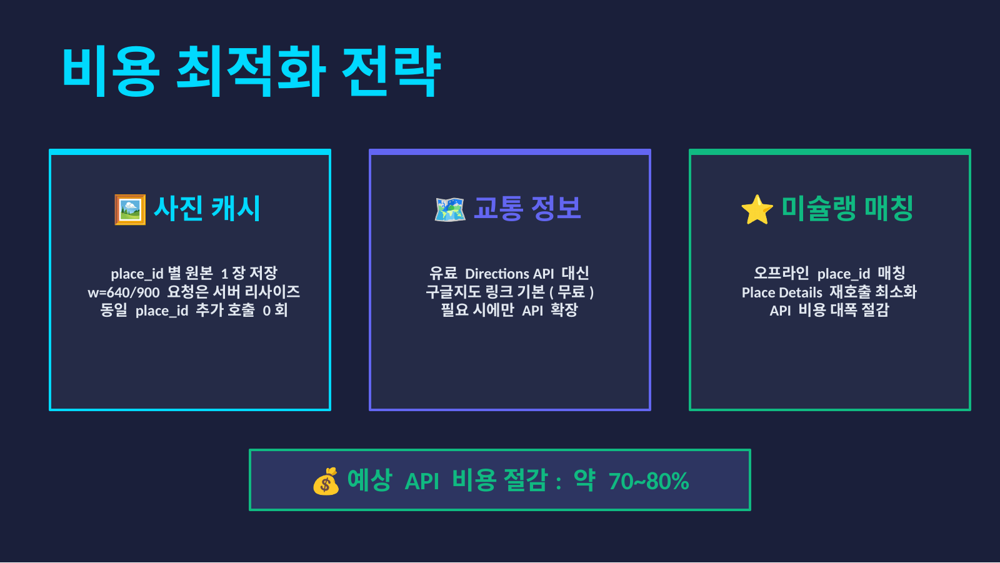

### 15. 1차 결과물
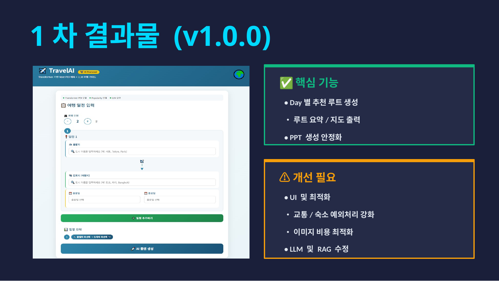

### 16. 최종 결과물


### 17. 시연 영상


### 18. 향후 연구방향
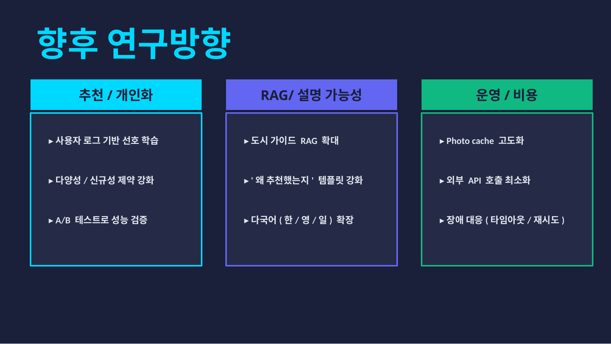

### 19. Q&A
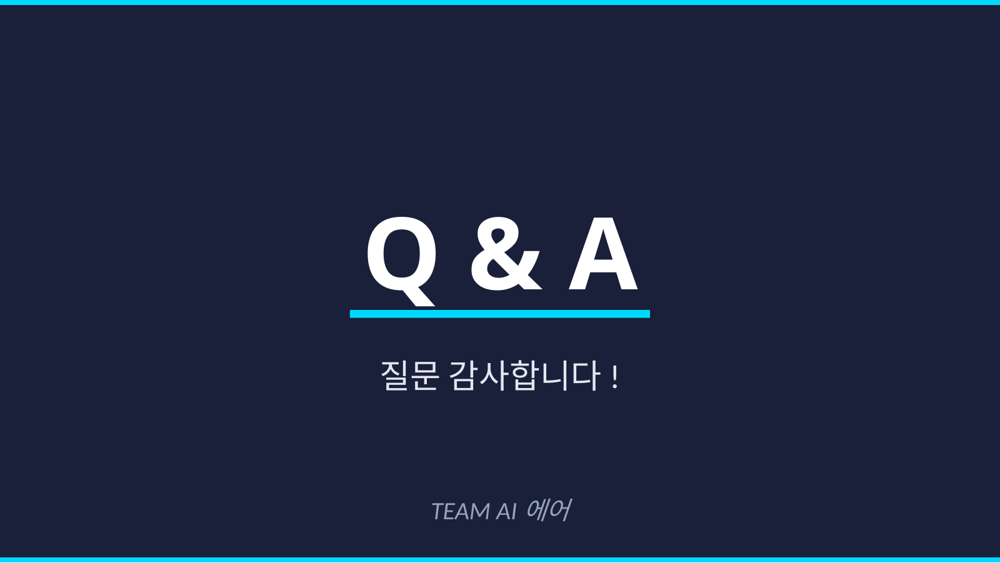

</details>

---

## 회고
이 프로젝트를 통해 가장 크게 배운 점은,
좋은 추천 서비스는 단순히 결과를 잘 내는 것만으로는 부족하다는 점이었습니다.

사용자가 결과를 신뢰하려면,
- 왜 이 결과가 나왔는지 설명할 수 있어야 하고
- 실제 사용 흐름에 맞게 기능이 연결되어 있어야 하며
- 데이터, 모델, UI, 발표까지 하나의 이야기로 정리될 수 있어야 했습니다.

저는 이 프로젝트에서 PM, LLM/RAG 구현, 데이터 수집, 발표를 맡으며
기획부터 구현, 정리까지 프로젝트 전체 흐름을 경험할 수 있었습니다.

---

## Links
- GitHub Profile: [taro87](https://github.com/taro87)
- Repository: https://github.com/taro87/ai
- Demo: 링크 추가
- PPT / 발표 영상: 링크 추가
